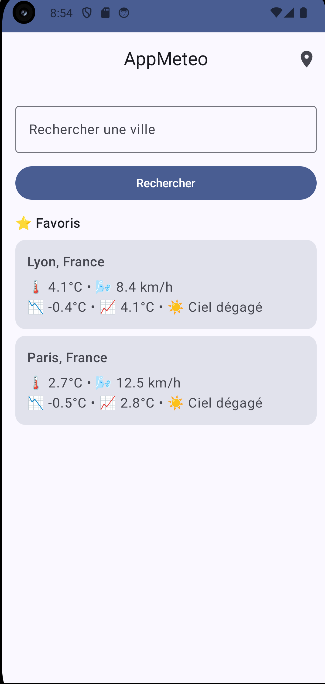
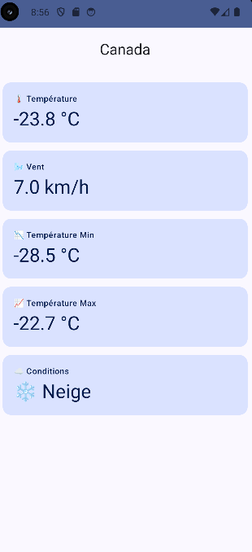

# 🌤️ AppMeteo - Application Météo Android

Application Android moderne de prévisions météorologiques utilisant l'API Open-Meteo avec système de favoris et cache hors-ligne.

---

## 📋 Table des Matières

- [Fonctionnalités](#-fonctionnalités)
- [Technologies Utilisées](#-technologies-utilisées)
- [Architecture](#-architecture)
- [Installation](#-installation)
- [Configuration](#-configuration)
- [Utilisation](#-utilisation)
- [Structure du Projet](#-structure-du-projet)
- [API Open-Meteo](#-api-open-meteo)
- [Gestion du Cache](#-gestion-du-cache)
- [Captures d'Écran](#-captures-décran)


---

## ✨ Fonctionnalités

### Fonctionnalités Obligatoires Implémentées

- ✅ **Écran d'accueil** avec barre de recherche
- ✅ **Recherche de ville** via API de geocoding Open-Meteo
- ✅ **Géolocalisation GPS** pour obtenir la météo locale (en cours d'implémentation)
- ✅ **Écran de détail** avec :
    - Température actuelle
    - Conditions météorologiques (emoji + description)
    - Températures minimale et maximale
    - Vitesse du vent
- ✅ **Système de favoris** (ajout/suppression)
- ✅ **Gestion du cache** :
    - Cache des données météo (30 minutes)
    - Persistance des favoris avec Room
    - Mode hors connexion fonctionnel
- ✅ **Gestion des erreurs** réseau avec messages clairs
- ✅ **Rotation d'écran** automatique

### Fonctionnalités Bonus

- 🎨 **Material Design 3** avec thème dynamique
- 🌓 **Mode sombre** automatique
- 🔄 **Architecture MVVM** propre et testable
- 💾 **Base de données locale** Room
- 🎯 **Navigation Compose** fluide
- ⚡ **Coroutines** pour les opérations asynchrones

---

## 🛠️ Technologies Utilisées

### Langage & Frameworks

- **Kotlin** 1.9.22
- **Jetpack Compose** - UI moderne et déclarative
- **Material Design 3** - Composants UI

### Architecture & Libraries

| Catégorie | Technologie | Version |
|-----------|-------------|---------|
| **Architecture** | MVVM | - |
| **UI** | Jetpack Compose | 2024.02.00 |
| **Navigation** | Navigation Compose | 2.7.6 |
| **Réseau** | Retrofit + Moshi | 2.9.0 / 1.15.0 |
| **Base de données** | Room | 2.6.1 |
| **Asynchrone** | Coroutines + Flow | 1.7.3 |
| **HTTP Client** | OkHttp | 4.12.0 |
| **Localisation** | Play Services Location | 21.1.0 |

---

## 🏗️ Architecture

### Pattern MVVM (Model-View-ViewModel)

```
┌─────────────────────────────────────────┐
│           UI Layer (Compose)            │
│      HomeScreen    DetailScreen         │
└──────────────┬──────────────────────────┘
               │
┌──────────────▼──────────────────────────┐
│          ViewModel Layer                │
│    HomeViewModel    DetailViewModel     │
└──────────────┬──────────────────────────┘
               │
┌──────────────▼──────────────────────────┐
│         Repository Layer                │
│        WeatherRepository                │
└────┬─────────────────────┬──────────────┘
     │                     │
┌────▼──────┐      ┌───────▼──────────┐
│  Remote   │      │   Local (Room)   │
│ Retrofit  │      │  FavoriteCity    │
│ Open-Meteo│      │  CachedWeather   │
└───────────┘      └──────────────────┘
```

### Couches de l'Application

1. **UI Layer** (`ui/`)
    - Screens Composables
    - ViewModels (gestion d'état)
    - Navigation

2. **Domain Layer** (implicite dans Repository)
    - Logique métier
    - Stratégie de cache

3. **Data Layer** (`data/`)
    - **Remote** : API Retrofit
    - **Local** : Room Database
    - **Repository** : Source unique de vérité

---

## 📥 Installation

### Prérequis

- **Android Studio** Hedgehog (2023.1.1) ou supérieur
- **JDK** 17 ou supérieur
- **Android SDK** 26 (Android 8.0) minimum
- **Gradle** 8.2+

### Étapes d'Installation

1. **Cloner le projet**
```bash
git clone https://github.com/votre-username/appmeteo.git
cd appmeteo
```

2. **Ouvrir dans Android Studio**
    - File > Open
    - Sélectionner le dossier du projet

3. **Synchroniser Gradle**
    - Cliquez sur "Sync Now" dans la bannière en haut
    - Ou : File > Sync Project with Gradle Files

4. **Lancer l'application**
    - Run > Run 'app'
    - Ou : Shift + F10

---

## ⚙️ Configuration

### Permissions Android

L'application nécessite les permissions suivantes (dans `AndroidManifest.xml`) :

```xml
<uses-permission android:name="android.permission.INTERNET" />
<uses-permission android:name="android.permission.ACCESS_NETWORK_STATE" />
<uses-permission android:name="android.permission.ACCESS_FINE_LOCATION" />
<uses-permission android:name="android.permission.ACCESS_COARSE_LOCATION" />
```

### Configuration API

Aucune clé API n'est requise. Open-Meteo est une API publique gratuite.

**Endpoints utilisés** :
- Geocoding : `https://geocoding-api.open-meteo.com/`
- Weather : `https://api.open-meteo.com/`

---

## 📱 Utilisation

### Écran d'Accueil

1. **Rechercher une ville**
    - Tapez au moins 2 caractères dans la barre de recherche
    - Cliquez sur "Rechercher"
    - Sélectionnez une ville dans les résultats

2. **Ajouter aux favoris**
    - Cliquez sur l'étoile ⭐ à côté d'une ville
    - La ville apparaît dans la section "Favoris"

3. **Voir les favoris**
    - Les favoris affichent un résumé météo
    - Données issues du cache (mode hors ligne)
    - Cliquez sur un favori pour voir les détails

### Écran de Détail

- **Température actuelle** : Affichée en grand
- **Vent** : Vitesse en km/h
- **Températures Min/Max** : Du jour
- **Conditions** : Emoji + description (ex: ☀️ Ciel dégagé)

### Mode Hors Connexion

- Les données sont mises en cache pendant **30 minutes**
- En l'absence de réseau, l'app utilise les données en cache
- Les favoris sont toujours accessibles hors ligne

---

## 📂 Structure du Projet

```
app/src/main/
├── java/com/manal/appmeteo/
│   ├── data/
│   │   ├── dto/                    # Data Transfer Objects
│   │   │   ├── GeoResponse.kt      # Modèle Geocoding
│   │   │   └── WeatherResponse.kt  # Modèle Météo
│   │   ├── local/                  # Base de données locale
│   │   │   ├── AppDatabase.kt      # Configuration Room
│   │   │   ├── WeatherDao.kt       # Data Access Object
│   │   │   ├── FavoriteCityEntity.kt
│   │   │   └── CachedWeatherEntity.kt
│   │   ├── remote/                 # API réseau
│   │   │   ├── OpenMeteoApi.kt     # Interface Retrofit
│   │   │   └── RetrofitClient.kt   # Configuration Retrofit
│   │   └── repository/
│   │       └── WeatherRepository.kt # Source unique de données
│   ├── ui/
│   │   ├── home/
│   │   │   ├── HomeScreen.kt       # Écran principal
│   │   │   └── HomeViewModel.kt    # Logique écran principal
│   │   ├── detail/
│   │   │   ├── DetailScreen.kt     # Écran détail
│   │   │   └── DetailViewModel.kt  # Logique détail
│   │   ├── navigation/
│   │   │   └── NavGraph.kt         # Configuration navigation
│   │   └── theme/
│   │       └── Theme.kt            # Thème Material 3
│   └── MainActivity.kt             # Point d'entrée
├── res/
│   ├── values/
│   │   └── themes.xml              # Thèmes XML
│   └── ...
└── AndroidManifest.xml
```

---

## 🌐 API Open-Meteo

### Geocoding API

**Endpoint** : `GET /v1/search`

**Exemple** :
```
https://geocoding-api.open-meteo.com/v1/search?name=Paris&count=10&language=fr
```

**Réponse** :
```json
{
  "results": [
    {
      "name": "Paris",
      "latitude": 48.8566,
      "longitude": 2.3522,
      "country": "France"
    }
  ]
}
```

### Weather API

**Endpoint** : `GET /v1/forecast`

**Exemple** :
```
https://api.open-meteo.com/v1/forecast?
  latitude=48.8566&
  longitude=2.3522&
  current=temperature_2m,wind_speed_10m,weather_code&
  daily=temperature_2m_min,temperature_2m_max&
  models=meteofrance_seamless
```

**Réponse** :
```json
{
  "latitude": 48.8566,
  "longitude": 2.3522,
  "current": {
    "temperature_2m": 18.5,
    "wind_speed_10m": 12.3,
    "weather_code": 0
  },
  "daily": {
    "temperature_2m_min": [12.0],
    "temperature_2m_max": [22.0]
  }
}
```

### Codes Météo

| Code | Condition | Emoji |
|------|-----------|-------|
| 0 | Ciel dégagé | ☀️ |
| 1-2 | Peu nuageux | 🌤️ |
| 3 | Couvert | ☁️ |
| 45-48 | Brouillard | 🌫️ |
| 51-55 | Bruine | 🌦️ |
| 61-65 | Pluie | 🌧️ |
| 71-75 | Neige | ❄️ |
| 95-99 | Orage | ⛈️ |

---

## 💾 Gestion du Cache

### Stratégie de Cache (3 niveaux)

```kotlin
// WeatherRepository.kt

1. Cache valide (< 30 min)
   ↓
   Retourne immédiatement les données en cache
   
2. Cache expiré ou inexistant
   ↓
   Appel API pour nouvelles données
   ↓
   Sauvegarde en cache
   
3. Erreur réseau
   ↓
   Retourne cache expiré (fallback mode hors ligne)
```

### Base de Données Room

**Table : favorite_cities**
- `cityKey` (PK) : "Paris|48.85|2.35"
- `name` : "Paris"
- `country` : "France"
- `latitude`, `longitude`
- `addedAt` : timestamp

**Table : cached_weather**
- `cityKey` (PK) : "Paris|48.85|2.35"
- `temperature`, `windSpeed`, `tempMin`, `tempMax`
- `conditionLabel` : "☀️ Ciel dégagé"
- `updatedAt` : timestamp

---

## 📸 Captures d'Écran

### Écran d'Accueil
```

```

### Écran de Détail
```

```

---

## 🧪 Tests

### Lancer les Tests

```bash
# Tests unitaires
./gradlew test

# Tests instrumentés (nécessite émulateur/appareil)
./gradlew connectedAndroidTest
```

### Scénarios de Test

- ✅ Recherche de ville avec résultats
- ✅ Recherche sans connexion internet
- ✅ Ajout/suppression de favoris
- ✅ Chargement des données en cache
- ✅ Mode hors ligne
- ✅ Rotation d'écran


---

## 👤 Auteur

**Manal**
- Projet : AppMeteo
- Framework : Android + Jetpack Compose


---

